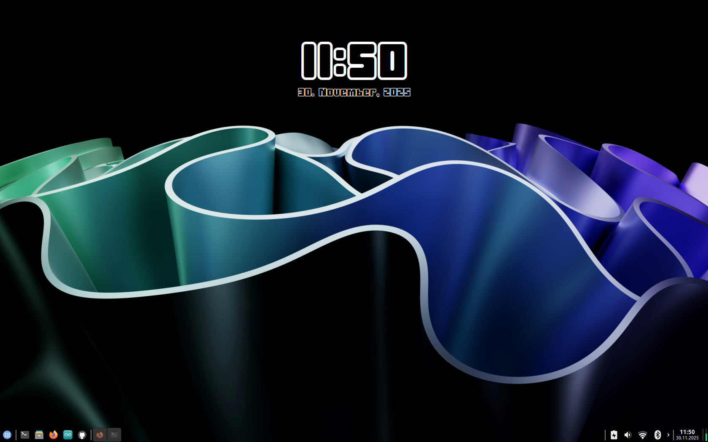

# modern & simple conky-clock

This is a custom conky script that adds a clock and date display to the desktop.

## Instruction
1. Install Conky using your distro's package manager.
2. Download this font: [Joygist Font](https://www.dafont.com/de/joygist.font)
3. Run the [installation-script](./install.sh)
4. Start conky: `conky`
5. Open the the `.conf` file in a text editor
6. Edit the value of `gap_x`and `gap_y` that it is in the right position
7. Enjoy

## Screenshots

